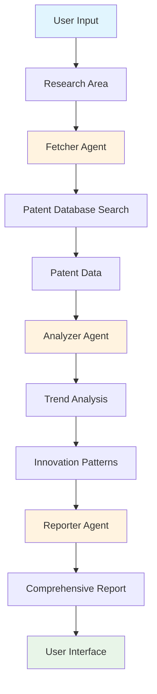

# 🔬 Patent Research AI Agent

> **Intelligent Patent Analysis & Innovation Prediction Powered by CrewAI**

[](https://www.python.org/downloads/)
[](https://github.com/joaomdmoura/crewAI)
[](https://opensource.org/licenses/MIT)
[](https://www.docker.com/)

<div align="center">


</div>

## 🎯 What is Patent Research AI Agent?

The Patent Research AI Agent is an intelligent system that automates patent research and innovation trend analysis using advanced AI agents. It combines multiple specialized AI agents working together to:

- 🔍 **Search & Fetch** relevant patents from multiple sources
- 📈 **Analyze Trends** and identify innovation patterns
- 📊 **Generate Reports** with actionable insights
- 🎯 **Predict Future** innovation directions

### 🏗️ How It Works



## ✨ Key Features

### 🤖 Multi-Agent Architecture
- **Fetcher Agent**: Searches patent databases and retrieves relevant data
- **Analyzer Agent**: Identifies trends, patterns, and innovation opportunities
- **Reporter Agent**: Generates comprehensive, actionable reports

### 📊 Advanced Analytics
- **Trend Analysis**: Identify emerging technology trends
- **Innovation Prediction**: Forecast future innovation directions
- **Competitive Intelligence**: Analyze competitor patent portfolios
- **Technology Mapping**: Visualize technology landscapes

### 🛠️ Production-Ready Features
- **Real-time Monitoring**: Prometheus metrics and Grafana dashboards
- **Health Checks**: Automated system health monitoring
- **Error Handling**: Comprehensive error recovery and logging
- **Rate Limiting**: API request management and optimization
- **Memory Management**: Long-term and short-term memory systems

### 🎨 User-Friendly Interface
- **Gradio Web UI**: Beautiful, responsive chat interface
- **Real-time Updates**: Live progress tracking
- **Export Options**: Multiple output formats
- **Interactive Results**: Rich markdown formatting

## 🚀 Quick Start

### Prerequisites
- Python 3.10 or higher
- OpenAI API key
- Serper API key (for web search)

### 1. Installation

```bash
# Clone the repository
git clone https://github.com/yourusername/patent-researcher-agent.git
cd patent-researcher-agent

# Install dependencies
pip install -e .

# Or use the setup script
make setup
```

### 2. Configuration

```bash
# Copy environment template
cp .env.example .env

# Edit with your API keys
nano .env
```

**Required Environment Variables:**
```env
OPENAI_API_KEY=your_openai_api_key_here
SERPER_API_KEY=your_serper_api_key_here
DEBUG=True
LOG_LEVEL=INFO
```

### 3. Launch the Application

```bash
# Method 1: Direct launch
python src/patent_researcher_agent/main.py

# Method 2: Using Makefile
make chat

# Method 3: Docker (recommended for production)
docker-compose up --build
```

### 4. Start Researching!

Open your browser to `http://localhost:7860` and start asking questions like:

- "What are the latest trends in quantum computing patents?"
- "Analyze innovation patterns in renewable energy storage"
- "Find emerging technologies in autonomous vehicles"

## 📁 Project Structure

```
patent_researcher_agent/
├── 🧠 src/patent_researcher_agent/
│   ├── core/                    # Core business logic
│   │   ├── models/             # Data models
│   │   ├── tools/              # Custom tools
│   │   └── listeners/          # Event listeners
│   ├── ui/                     # User interface
│   │   ├── components/         # UI components
│   │   └── themes/             # UI themes
│   ├── utils/                  # Utilities
│   ├── config/                 # Configuration files
│   ├── crew.py                 # Main crew orchestration
│   ├── main.py                 # Application entry point
│   └── launch_chat.py          # Chat interface launcher
├── 🧪 tests/                   # Test suite
├── 📚 docs/                    # Documentation
├── 🐳 docker/                  # Docker configuration
├── 📊 monitoring/              # Monitoring & metrics
├── 🔧 scripts/                 # Utility scripts
└── 📦 pyproject.toml           # Project configuration
```

## 🎮 Usage Examples

### Basic Research Query
```python
from patent_researcher_agent.crew import PatentInnovationCrew

# Initialize the crew
crew = PatentInnovationCrew()

# Start research
result = crew.crew().kickoff({
    'research_area': 'artificial intelligence in healthcare',
    'current_date': '2024-01-15'
})

print(result)
```

### Advanced Configuration
```yaml
# config/agents.yaml
fetcher_agent:
  name: "Patent Fetcher"
  role: "Expert patent researcher and data collector"
  goal: "Find the most relevant and recent patents in the given domain"
  backstory: "You are an expert patent researcher with years of experience..."

analyzer_agent:
  name: "Trend Analyzer"
  role: "Patent trend analyst and innovation predictor"
  goal: "Identify patterns, trends, and future innovation opportunities"
  backstory: "You are a senior patent analyst specializing in..."
```

## 📊 Monitoring & Analytics

### Real-time Metrics
The system provides comprehensive monitoring with:

- **Agent Performance**: Execution times, success rates, error counts
- **Task Analytics**: Task completion rates and durations
- **System Health**: Memory usage, API response times
- **User Activity**: Query patterns and usage statistics

### Monitoring Setup

```bash
# Local monitoring (development)
make monitoring-setup

# Full monitoring stack (production)
make monitoring-setup-full

# View metrics
make monitoring-metrics

# Access dashboards
make dashboard
```

**Available Dashboards:**
- 📈 **Performance Dashboard**: Real-time agent and task metrics
- 🔍 **Analytics Dashboard**: Patent research insights
- 🏥 **Health Dashboard**: System health and status

## 🧪 Testing

```bash
# Run all tests
make test

# Run specific test categories
make test-unit
make test-integration

# Run with coverage
pytest tests/ -v --cov=src/patent_researcher_agent --cov-report=html
```

## 🐳 Docker Deployment

### Quick Docker Setup
```bash
# Build and run
docker-compose up --build

# Or build manually
docker build -t patent-researcher-agent ./docker
docker run -p 7860:7860 patent-researcher-agent
```

### Production Deployment
```bash
# Production with monitoring
docker-compose -f docker-compose.monitoring.yml up --build
```

## 🔧 Development

### Available Commands
```bash
make help                    # Show all available commands
make setup                   # Setup development environment
make install                 # Install dependencies
make test                    # Run tests
make format                  # Format code
make lint                    # Run linting
make clean                   # Clean generated files
make health-check            # Run health check
make backup                  # Create data backup
```

### Contributing
1. Fork the repository
2. Create a feature branch (`git checkout -b feature/amazing-feature`)
3. Commit your changes (`git commit -m 'Add amazing feature'`)
4. Push to the branch (`git push origin feature/amazing-feature`)
5. Open a Pull Request

## 📚 Documentation

- **[User Guide](docs/user_guide/README.md)**: Complete user documentation
- **[Developer Guide](docs/developer_guide/README.md)**: Development setup and guidelines
- **[Architecture](docs/architecture/README.md)**: System architecture overview
- **[Production Guide](docs/PRODUCTION.md)**: Production deployment guide
- **[API Reference](docs/API.md)**: API documentation

## 🤝 Contributing

We welcome contributions! Please see our [Contributing Guide](CONTRIBUTING.md) for details.

### Development Setup
```bash
# Clone and setup
git clone https://github.com/yourusername/patent-researcher-agent.git
cd patent-researcher-agent
make setup

# Run tests
make test

# Start development server
make chat
```

## 📄 License

This project is licensed under the MIT License - see the [LICENSE](LICENSE) file for details.

## 🙏 Acknowledgments

- **[CrewAI](https://github.com/joaomdmoura/crewAI)**: Multi-agent framework
- **[Gradio](https://gradio.app/)**: Web interface framework
- **[MLflow](https://mlflow.org/)**: Machine learning lifecycle management
- **[Prometheus](https://prometheus.io/)**: Monitoring and alerting

## 📞 Support

- 📧 **Email**: support@patent-researcher-agent.com
- 💬 **Discussions**: [GitHub Discussions](https://github.com/yourusername/patent-researcher-agent/discussions)
- 🐛 **Issues**: [GitHub Issues](https://github.com/yourusername/patent-researcher-agent/issues)
- 📖 **Documentation**: [Full Documentation](docs/README.md)

---

<div align="center">

**Made with ❤️ by the Patent Research AI Team**

[](https://github.com/yourusername/patent-researcher-agent)
[](https://github.com/yourusername/patent-researcher-agent)
[](https://github.com/yourusername/patent-researcher-agent/issues)

</div> 